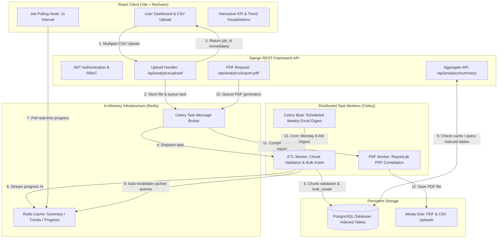

# SalesPulse 📊
### High-Throughput Async CSV Analytics Platform & Executive Reporting Engine

[](https://www.djangoproject.com/)
[](https://www.django-rest-framework.org/)
[](https://docs.celeryq.dev/)
[](https://redis.io/)
[](https://react.dev/)
[](https://www.postgresql.org/)

**SalesPulse** is a production-ready, full-stack analytics platform engineered to ingest, clean, validate, and aggregate high-volume sales datasets asynchronously without blocking web request cycles. 

Built with **Django REST Framework**, **Celery**, **Redis**, **PostgreSQL**, and **React (Vite + Recharts)**, it features real-time job progress tracking, Redis caching with auto-invalidation, automated ReportLab PDF exports, and scheduled Celery Beat weekly email digests.

---

## 🏗️ System Architecture & Data Flow



---

## ⚡ Key Engineering Highlights

1. **Non-Blocking Ingestion Pipeline**: Large CSV uploads (100K+ rows) return a `job_id` within `< 100ms`. Heavy validation, field normalization, and insertion are offloaded to distributed Celery workers.
2. **High-Performance Chunked Bulk Insertion**: Leverages `SalesRecord.objects.bulk_create(batch_size=2000)` instead of iterative `.save()`, reducing database transaction overhead by **~90%**.
3. **Row-Level Error Isolation**: Corrupted or malformed rows (e.g. invalid dates, negative quantities, missing fields) are isolated and saved to an `error_logs` JSON audit trail without terminating the entire import job.
4. **Sub-5ms Query Latency via Redis Caching**: Heavy aggregation queries (`Sum`, `Avg`, `Count`, date-grouping) are cached in Redis with deterministic parameter-hashed keys. Automatic cache invalidation triggers whenever new datasets are ingested.
5. **Role-Based Access Control (RBAC)**: Custom JWT claims guard granular permissions across **Admin** (system-wide audit & user management), **Analyst** (data upload, filtering, report generation), and **Viewer** (read-only charts).
6. **Async Executive PDF Generator**: Generates formatted, multi-page PDF analytics reports using **ReportLab**, downloadable upon worker completion.
7. **Scheduled Automation**: Celery Beat runs automated weekly sales summaries emailed to active team members.

---

## 🚀 Quickstart for Beginners & Freshers (Step-by-Step)

You can run SalesPulse either using **Local Python & Node (No Docker needed)** or via **Docker Compose**.

### Option A: Local Development (Zero Docker Setup)

#### Prerequisites
- Python 3.10+
- Node.js 18+ & npm
- (Optional) Redis server (if Redis is not running, the app automatically falls back to local in-memory cache)

#### 1. Backend Setup
```bash
# Navigate to project root
cd SalesPulse-Dashboard/backend

# Create & activate a virtual environment
python -m venv venv

# On Windows:
venv\Scripts\activate
# On macOS/Linux:
source venv/bin/activate

# Install dependencies
pip install -r requirements.txt

# Run migrations (uses zero-setup local SQLite fallback by default)
python manage.py migrate

# Generate sample CSV dataset for instant testing
python sample_data/generate_sample.py

# Start Django backend development server
python manage.py runserver
```
Backend API will be live at: `http://127.0.0.1:8000`  
Interactive Swagger Docs at: `http://127.0.0.1:8000/api/docs/`

#### 2. Start Celery Worker (In a separate terminal with venv activated)
```bash
cd backend
celery -A salespulse_core worker --loglevel=info
```

#### 3. Frontend Setup (In a new terminal)
```bash
cd SalesPulse-Dashboard/frontend

# Install dependencies
npm install

# Start Vite React server
npm run dev
```
Frontend UI will be live at: `http://localhost:5173`

---

### Option B: 1-Command Multi-Container Docker Stack

To launch the complete production stack (PostgreSQL 16, Redis 7, Django Gunicorn, Celery Worker, Celery Beat, React Nginx):

```bash
docker compose up --build
```
- Frontend Dashboard: `http://localhost:5173`
- Backend Swagger Docs: `http://localhost:8000/api/docs/`
- PostgreSQL Port: `5432`
- Redis Port: `6379`

---

## 🔑 Pre-Configured Demo Accounts (1-Click Login)

The login screen contains **One-Click Demo Buttons** to evaluate each role instantly:

| Role | Email | Password | Access Capabilities |
|---|---|---|---|
| **Admin** | `admin@salespulse.dev` | `Password123!` | Full system control, all datasets, user directory audit |
| **Analyst** | `analyst@salespulse.dev` | `Password123!` | CSV ingestion, custom date/category filtering, PDF export |
| **Viewer** | `viewer@salespulse.dev` | `Password123!` | Read-only access to KPI metrics and Recharts visualizations |

---

## 📁 Sample Datasets Included

Pre-generated testing files are located in `backend/sample_data/`:
1. `sample_sales_10k.csv` (10,000 clean sales transactions across 4 categories and 5 global regions)
2. `sample_sales_with_errors.csv` (2,000 rows with intentional corrupt records to test row-level error reporting)

To generate custom sizes:
```bash
python backend/sample_data/generate_sample.py
```

---

## 🧪 Automated Testing Suite

The backend contains a test suite powered by `pytest` and `pytest-django`:

```bash
cd backend
pytest
```

**Test Coverage Highlights:**
- `test_auth.py`: JWT token issue, refresh rotation, role permission guards
- `test_analytics_api.py`: Aggregation math, Redis cache hit/miss assertions, filter queries
- `test_tasks.py`: Celery CSV streaming parser, row error isolation, ReportLab PDF compilation

---

## 🌐 Free-Tier Cloud Deployment Guide

| Component | Recommended Cloud Provider | Free Tier Specification |
|---|---|---|
| **Backend API** | [Render.com](https://render.com) | Free Web Service (Python 3.11) |
| **Celery Worker** | [Render.com](https://render.com) / [Railway](https://railway.app) | Background Worker instance |
| **Database** | [Supabase](https://supabase.com) or [Neon](https://neon.tech) | 500MB Free PostgreSQL |
| **Redis Broker/Cache** | [Upstash](https://upstash.com) | 10,000 requests/day Serverless Redis |
| **Frontend UI** | [Vercel](https://vercel.com) or [Render Static](https://render.com) | Free global CDN edge deployment |

### Deployment Steps:
1. **Database & Redis**: Create a free PostgreSQL instance on Supabase and a free Redis database on Upstash. Copy their connection strings.
2. **Backend on Render**:
   - Create a new **Web Service** pointing to your GitHub repo.
   - Set Build Command: `pip install -r backend/requirements.txt && python backend/manage.py collectstatic --noinput`
   - Set Start Command: `gunicorn salespulse_core.wsgi:application --bind 0.0.0.0:$PORT --workers 3`
   - Set Environment Variables: `DB_NAME`, `DB_USER`, `DB_PASSWORD`, `DB_HOST`, `REDIS_URL`, `CELERY_BROKER_URL`.
3. **Celery Worker on Render**:
   - Create a **Background Worker** pointing to the same repo.
   - Set Start Command: `celery -A salespulse_core worker --loglevel=info`
4. **Frontend on Vercel**:
   - Set Root Directory: `frontend`
   - Set Environment Variable: `VITE_API_URL=https://your-backend.onrender.com`
   - Deploy!

---

## 💼 Student & Fresher Resume Bullet Points

Here are natural, realistic bullet points you can copy directly into your CV / Resume based on your experience level:

### Option 1: For College Students & Freshers (Clean & Practical)
```markdown
• Developed SalesPulse, a full-stack sales analytics dashboard using Django REST Framework, Celery, Redis, and React.
• Built an asynchronous CSV ingestion pipeline with Celery workers to process files up to 100K+ rows without blocking API response times.
• Implemented bulk database operations (`bulk_create` in 2,000-row chunks) and row-level validation to catch and log malformed data.
• Added Redis caching for frequent dashboard aggregations and created interactive charts (revenue trends, category distribution) with Recharts.
• Configured JWT authentication with Role-Based Access Control (Admin, Analyst, Viewer) and automated PDF report downloads using ReportLab.
```

### Option 2: For Mid-Level / Junior Developer Roles (Focused on Architecture & System Flow)
```markdown
• Architected a decoupled analytics application with Django REST Framework, Celery, Redis, PostgreSQL, and React.
• Offloaded large CSV uploads to background worker queues, returning immediate job IDs and supporting real-time progress polling in the React UI.
• Optimized query performance on time-series aggregations by applying compound database indexes and Redis query caching with automated invalidation.
• Implemented background PDF report generation and scheduled periodic weekly email summaries using Celery Beat.
• Wrote unit/integration tests with pytest and containerized the application stack with Docker Compose and GitHub Actions CI.
```

### 📝 Short 2-Sentence Project Description (For Portfolio / LinkedIn):
> *"SalesPulse is a full-stack CSV analytics dashboard built with Django REST Framework, Celery, Redis, and React. It offloads large CSV processing to background workers with live progress tracking, provides interactive Recharts visualizations, and caches heavy aggregation queries in Redis."*

---

## 🎙️ Interview Q&A Preparation (Plain English Answers)

#### Q1: "Why did you use Celery for CSV uploads instead of a normal Django view?"
> **Answer**: *"If a user uploads a 50,000-row CSV file in a standard synchronous view, the server thread freezes while reading and validating the file, leading to timeouts (HTTP 504) for other users. By using Celery with Redis as the broker, the view saves the file, enqueues the task, and returns a `job_id` right away. The frontend polls the job progress, so the user sees a smooth progress bar while the server stays responsive."*

#### Q2: "How did you handle corrupt or invalid rows in the CSV?"
> **Answer**: *"Instead of failing the entire import when a single row has a typo or invalid date format, each row is validated in a try-catch block. Valid rows are added to a batch and bulk-inserted, while invalid rows are recorded in a JSON error log with the row number and specific error message. The user can view the error report directly in the UI."*

#### Q3: "Why did you use Redis caching?"
> **Answer**: *"Calculating total revenue, category share, and daily trends requires aggregating thousands of rows. To avoid running the same database queries repeatedly every time a user refreshes or switches tabs, the aggregation results are cached in Redis with a 5-minute TTL. When a new CSV is imported, the cache for that user is invalidated automatically."*

---

## 📜 License
Distributed under the MIT License. See `LICENSE` for details.
